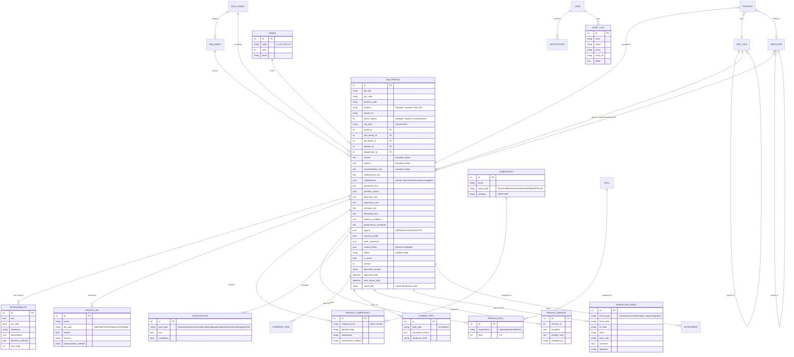

# Database Design & ER Diagram

Normalized around the **job profile as master record**. Long template sections are kept
verbatim (fidelity to the official document) *and* parsed into structured child rows
(analytics/AI) — the same duality the organization already practices between Word
profiles and the master workbook, now governed in one place.

## ER diagram

## Key relationships explained

- **Grade** encodes the Irancell level structure as first-class data: `code` is what HR
  writes ("3H"), `rank` makes it sortable, `band` gives the human meaning. Profiles keep
  the raw text in `org_level` too, so nothing from the source workbook is lost.
- **Role family ← Job family ← Profile** mirrors the organization's architecture: role
  families derive from divisions (Network Group, Finance, …); job families from the
  functional stem of titles (e.g. "Access Transmission Planning and Optimization"), which
  is also what powers auto-derived **career ladders** — edges connect profiles within a
  family ordered by title seniority (Engineer → Specialist → Senior Specialist →
  Manager → Senior Manager → General Manager).
- **Competency** is a shared catalog (deduplicated by name+type), so "Network Planning
  and Design" is one row referenced by hundreds of profiles — this is what makes
  competency analytics and gap analysis possible.
- **ProfileVersion.snapshot** stores the full serialized profile (same shape as the JSON
  export), making versions self-contained and restorable without schema archaeology.
- **WorkflowEvent** is append-only; the profile's `status` is the current state, the
  events are the proof.
- **source_file** is the import idempotency key: re-importing the master workbook
  updates matching profiles in place.
- **Employee / Position** are integration surfaces: JPMS does not own people data, it
  links to it so "find internal successors / who holds this role" queries work when the
  HRIS sync is connected.

## Indexing

Foreign keys, `job_profiles.job_title`, `job_code`, `status` and audit timestamps are
indexed. For PostgreSQL production add a `tsvector` GIN index over the text sections
(or route search to OpenSearch) beyond ~10k profiles.
